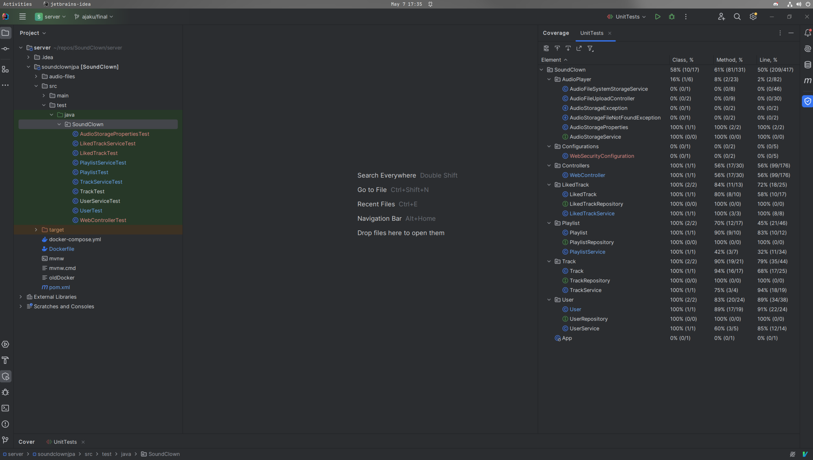

#  SoundClown 

This is a SoundCloud clone for [ECE366](https://cooper.edu/engineering/courses/electrical-and-computer-engineering-undergraduate/ece-366).

To start up the  server you first need to ssh into the AWS server hosting the website, so reach out to either:
- andy.jaku@cooper.edu
- fred.kim@cooper.edu
- daniel.tsarev@cooper.edu

From there, a `docker-compose up` will get the website running.

If you would instead prefer to run the project locally, go to `client/soundclownui` and change the `Dockerfile` to the `oldDocker`, you will also need to change the address of HTTP requests to `localhost:8080` instead of the server's IP address. Then perform `docker-compose build` and `docker-compose up`.

## Code of Ethics 
- 1.1 Contribute to society and to human well-being, acknowledging that all people are stakeholders in computing.

- 1.4 Be fair and take action not to discriminate.

- 1.7 Honor confidentiality.

- 2.1 Strive to achieve high quality in both the processes and products of professional work.

- 2.2 Maintain high standards of professional competence, conduct, and ethical practice.

- 2.3 Know and respect existing rules pertaining to professional work.

- 2.9 Design and implement systems that are robustly and usably secure.

- 3.1 Ensure that the public good is the central concern during all professional computing work.
 
- 3.3 Manage personnel and resources to enhance the quality of working life.

- 3.6 Use care when modifying or retiring systems.

## Unit Test Coverage
